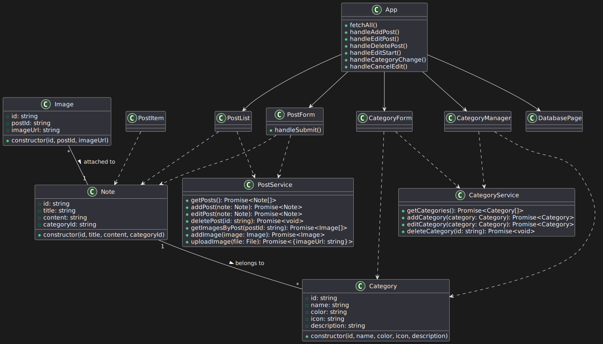

# NoteKeeper Documentation

## Table of Contents

- [Overview](#1-overview)
- [Main Features](#2-main-features)
- [User Scenarios](#3-user-scenarios)
- [Scenarios diagram](#4-scenarios-diagram)
- [Project Structure Architecture and Operating principle](#5-project-structure-architecture-and-operating-principle)
- [Data Model and Database Structure](#6-data-model-and-database-structure)
- [API Documentation](#8-api-documentation)

## 1. OVERVIEW

NoteKeeper is an application for creating, editing, deleting, and searching notes with user-defined categories. It consists of a React frontend and a Node.js (Express) backend API with SQLite database. Notes and categories are stored persistently in the database and accessed via REST API.

### How to Run

#### Backend

1. Install dependencies:
   ```
   npm install
   ```
2. Start the server:
   ```
   node server.js
   ```
   Server runs on http://localhost:4000

#### Frontend

1. Install dependencies:
   ```
   npm install
   ```
2. Start the app:
   ```
   npm start
   ```
   App runs on http://localhost:3000

## 2. MAIN FEATURES

The application allows you to:

- Create, edit and delete notes;
- Create, edit and delete note categories;
- Search notes by title;
- Sort notes by categories;
- Add and delete images to notes;
- Work with the notes database.

### Technologies

1. React: The primary library for creating user interfaces. It breaks down the interface into components.

2. React DOM: A library that allows React to interact with the DOM (Document Object Model) of the browser.

3. React Router: Used to manage the routing in the application, allowing users to navigate between different pages, such as adding a note, managing categories, and browsing a database.

4. Bootstrap: A CSS framework that provides ready-made styles and components for quickly creating a responsive and beautiful interface.

5. Express: A web framework for Node.js that is used to create a server and handle requests to RESTful APIs.

6. CORS (Cross-Origin Resource Sharing): A package for setting up CORS on the server, allowing browsers to make requests to resources from other domains.

7. Multer: Middleware for handling multipart/form-data, which allows you to upload files to the server (for example, images for notes).

8. sqlite3: allows you to create a lightweight database.

9. web-vitals: A library for measuring the performance of web applications, including important metrics like load time, time to first render, and more.

10. swagger: allows you to create interactive application documentation.

11. React Scripts: A set of scripts that makes it easy to set up and run React applications, including commands for building, testing, and running the application.

## 3. USERS SCENARIOS

### Notes

- On the start page or when you click the "Add note" button, a special form for filling in the note fields is displayed on the screen. The user sequentially fills in the title and description of the note.


- After filling in the form fields, the user selects an image for the note by clicking the add file button.


- The user selects the post category
- The user clicks "Add note".
- After successful addition, a green success message appears at the top of the page.

- After saving, the note goes to the posts page.


- The user can edit the post by clicking the Edit button on the Posts page or the Database page
- The user changes the title, content, and image.
- The user clicks the Save button to save the changes or the Cancel button to discard them and return to the list of posts.
- After successful editing, a green success message appears at the top of the page.

### Categories

- The user selects the Categories section


- The user enters the name, color, and icon
- The user clicks the Create Category button and the added category is displayed on the page.
- In the Manage Categories block, the user can edit the desired category by clicking the Edit button opposite its name. Editing fields will be displayed under all categories.


- After making changes to the category being edited, the user clicks the Save button to save the changes or the Cancel button to cancel them. The changes will be displayed in the edited category.
- The user can delete a category by clicking the Delete button opposite its name. The category will be removed from the list of categories.

### Database

- The user presses the Database button, the active tab with the table of posts will be displayed on the screen


- The user selects a tab (posts, categories, images), the corresponding table will be displayed on the screen


- The user presses the edit button opposite the table name, the row becomes editable
- The user makes changes to the corresponding fields and presses the Save or Cancel button to save or cancel the changes

## 4. UML DIAGRAMS

### Scenarios diagram

**Notes**


**Categories**


**Database**


Visualization of technical processes is made using [todiagram](https://todiagram.com)

### Component Diagram (Logical Architecture)


This component diagram shows the high-level structure and internal organization of the NoteKeeper application.

It includes the main frontend React components, frontend services, backend controllers, database service, and their relationships.

The diagram illustrates how the user interacts with the UI, how components communicate with each other and with the backend, and how data flows through the system.

- User interacts with the main App component.
- App composes all main UI components: PostForm, PostList, CategoryForm, CategoryManager, and DatabasePage.
- UI components use service classes (PostService, CategoryService) to communicate with the backend API.
- Services send HTTP requests to the backend (ExpressApp), which delegates requests to the appropriate controllers.
- Controllers use DatabaseService to interact with the SQLite database.
- File uploads are handled by UploadController and stored in the uploads/ folder.
- The interactive API documentation is served by SwaggerController.
- The diagram helps developers understand both the overall architecture and the main dependencies within the frontend.

### Sequence Diagram (Key Scenario: Add Note with Image)


The sequence diagram below illustrates the step-by-step interaction between the main actors and components of the NoteKeeper application during the process of adding a new note with an image.

- User initiates the process by opening the Add Note form in the frontend.
- Frontend (React) collects the note data and the image file from the user.
- The image file is uploaded to the backend via a separate API call (/api/upload), where it is saved to the file storage.
- The backend returns the URL of the uploaded image to the frontend.
- The frontend then sends the note data to the backend (/api/posts), which stores the note in the database.
- After the note is created, the frontend creates an image record (/api/images) linking the uploaded image to the note.
- The backend stores this image record in the database.
- At each step, the backend returns confirmation or data to the frontend, and the frontend provides feedback to the user (e.g., a success message).

This diagram helps developers and analysts understand the dynamic flow of data and control between the user, frontend, backend, file storage, and database during a typical user action.

### Class Diagram



- `App` composes all main UI components and coordinates their state and data flow.
- `PostForm`, `PostList`, `PostItem`, `CategoryForm`, and `CategoryManager` receive data and callback functions as props from `App`.
- `PostForm` and `PostList` use `PostService` to interact with the backend API for notes and images.
- `CategoryForm` and `CategoryManager` use `CategoryService` to interact with the backend API for categories.
- `Note` and `Category` are data models used throughout the frontend and are passed between components and services.
- Each `Note` belongs to a single `Category` (via `categoryId`), and each `Category` can have multiple `Note` objects.
- Each `Image` is attached to a single `Note` (via `postId`), and each `Note` can have multiple `Image` objects.
- On the backend, controllers (e.g., `PostController`, `CategoryController`) use `DatabaseService` to perform database operations.

## 5. PROJECT STRUCTURE ARCHITECTURE AND OPERATING PRINCIPLE

```
note-keeper/
├── backend/
│   ├── server.js
│   ├── package.json
│   ├── package-lock.json
│   ├── uploads/
│   ├── db/
│   │   └── DatabaseService.js
│   ├── controllers/
│   │   ├── CategoryController.js
│   │   ├── PostController.js
│   │   ├── ImageController.js
│   │   ├── UploadController.js
│   │   └── SwaggerController.js
│   └── node_modules/
├── frontend/
│   ├── src/
│   │   ├── components/
│   │   │   ├── App.js
│   │   │   ├── PostForm.js
│   │   │   ├── PostList.js
│   │   │   ├── PostItem.js
│   │   │   ├── CategoryForm.js
│   │   │   ├── CategoryManager.js
│   │   │   └── DatabasePage.js
│   │   ├── services/
│   │   │   ├── PostService.js
│   │   │   └── CategoryService.js
│   │   ├── models/
│   │   │   ├── Note.js
│   │   │   └── Category.js
│   │   ├── App.css
│   │   ├── index.js
│   │   ├── index.css
│   │   └── reportWebVitals.js
│   ├── public/
│   ├── package.json
│   ├── package-lock.json
│   └── node_modules/
├── database/
    └── note-keeper.db
```

**backend**

- server.js — Main entry point. Initializes Express, connects middleware, and registers all controllers.
- package.json, package-lock.json — Backend dependencies and scripts.
- uploads/ — Stores all images uploaded by users (served as static files).
- db/DatabaseService.js — Handles SQLite database connection and schema initialization.
- controllers/ — Each file is a class responsible for a specific API resource or feature:
  - CategoryController.js — CRUD for categories.
  - PostController.js — CRUD for notes.
  - ImageController.js — CRUD for images.
  - UploadController.js — Handles file uploads (Multer).
  - SwaggerController.js — Serves Swagger UI for API documentation.

**frontend**

- src/ — Main source code for the React app.
- components/ — All React UI components:
  - App.js — Main application component, routing, global state.
  - PostForm.js — Form for adding/editing notes.
  - PostList.js — List of notes, filtering, actions.
  - PostItem.js — Single note display.
  - CategoryForm.js — Form for adding a new category.
  - CategoryManager.js — Edit/delete categories.
  - DatabasePage.js — View/edit database tables from the browser.
- services/ — API service classes:
  - PostService.js — All API requests for notes and images.
  - CategoryService.js — All API requests for categories.
- models/ — Data model classes:
  - Note.js — Note class.
  - Category.js — Category class.
- App.css, index.js, index.css, reportWebVitals.js — Styling, entry points, and performance reporting.
- public/ — Static files (HTML, icons, manifest, etc.).
  package.json, package-lock.json — Frontend dependencies and scripts.

**database**

- note-keeper.db — SQLite database file. Stores all notes, categories, and images.

### Principles of Work

- **Object-Oriented Model:** All main entities in the application—notes, categories, and images—are represented as objects. On the frontend, these are JavaScript classes (e.g., Note, Category); on the backend, they are JavaScript objects mapped to SQL tables.
- **Object Lifecycle:** Objects are created (e.g., when a user adds a note), transferred between frontend and backend as JSON, stored in the database, and manipulated (edited, deleted, filtered) through API calls.
- **Data Flow:**
  - The user interacts with the React interface, which manages application state using objects (notes, categories, etc.).
  - When the user performs an action (add, edit, delete), the frontend creates or updates an object and sends it to the backend via a REST API call.
  - The backend receives the object, processes it (e.g., saves to the database), and returns the updated object or a status response.
  - The frontend updates its state and UI based on the response.
- **Component-Based Architecture:**
  - The frontend is organized into reusable React components (e.g., PostForm, PostList, CategoryManager), each responsible for a specific part of the UI and logic.
  - The backend is organized into modular Express routes and handlers, each managing a specific resource (notes, categories, images).
- **Data Consistency:** All data is persisted in a SQLite database, ensuring that objects remain consistent and available across sessions.
- **Communication:** All data exchange between frontend and backend is performed in JSON format, making the transfer of objects simple and language-agnostic.

### Technically

- **Frontend (React)** runs separately and communicates with the backend API over HTTP (usually http://localhost:4000).
- **Backend (Node.js + Express)** implements the REST API, processes requests, performs SQL operations with the database, and stores uploaded images.
- **Database** is stored in the file `note-keeper/database/note-keeper.db` and is created automatically on the first server launch.
- **Image upload** is implemented via the `/api/upload` endpoint using Multer. Files are saved in `note-keeper/backend/uploads`, and links to them are stored in the `images` table.
- **API structure** is fully described in the `openapi.yaml` file.

### Backend (Node.js + Express)

#### 1. Database Initialization

Creates tables for categories, posts, and images if they do not exist.

```js
const db = new sqlite3.Database("../database/note-keeper.db");
db.serialize(() => {
  db.run(`CREATE TABLE IF NOT EXISTS categories (
        id TEXT PRIMARY KEY,
        name TEXT NOT NULL,
        color TEXT NOT NULL,
        icon TEXT,
        description TEXT
    );`);
  db.run(`CREATE TABLE IF NOT EXISTS posts (
        id TEXT PRIMARY KEY,
        title TEXT NOT NULL,
        content TEXT NOT NULL,
        categoryId TEXT NOT NULL,
        FOREIGN KEY (categoryId) REFERENCES categories(id) ON DELETE CASCADE ON UPDATE CASCADE
    );`);
  db.run(`CREATE TABLE IF NOT EXISTS images (
        id TEXT PRIMARY KEY,
        postId TEXT NOT NULL,
        imageUrl TEXT NOT NULL,
        FOREIGN KEY (postId) REFERENCES posts(id) ON DELETE CASCADE ON UPDATE CASCADE
    );`);
});
```

#### 2. CRUD Endpoints for Notes

Handles getting, creating, updating, and deleting notes.

```js
app.get("/api/posts", (req, res) => {
  db.all("SELECT * FROM posts", [], (err, rows) => {
    if (err) return res.status(500).json({ error: err.message });
    res.json(rows);
  });
});

app.post("/api/posts", (req, res) => {
  const { id, title, content, categoryId } = req.body;
  db.run(
    "INSERT INTO posts (id, title, content, categoryId) VALUES (?, ?, ?, ?)",
    [id, title, content, categoryId],
    function (err) {
      if (err) return res.status(500).json({ error: err.message });
      res.status(201).json({ id, title, content, categoryId });
    }
  );
});

app.put("/api/posts/:id", (req, res) => {
  const { title, content, categoryId } = req.body;
  db.run(
    "UPDATE posts SET title=?, content=?, categoryId=? WHERE id=?",
    [title, content, categoryId, req.params.id],
    function (err) {
      if (err) return res.status(500).json({ error: err.message });
      res.json({ id: req.params.id, title, content, categoryId });
    }
  );
});

app.delete("/api/posts/:id", (req, res) => {
  db.run("DELETE FROM posts WHERE id=?", [req.params.id], function (err) {
    if (err) return res.status(500).json({ error: err.message });
    res.status(204).end();
  });
});
```

**Explanation:** These endpoints allow the frontend to fetch, create, update, and delete notes. Similar endpoints exist for categories and images.

#### 3. CRUD Endpoints for Categories

Handles getting, creating, updating, and deleting categories.

```js
app.get("/api/categories", (req, res) => {
  db.all("SELECT * FROM categories", [], (err, rows) => {
    if (err) return res.status(500).json({ error: err.message });
    res.json(rows);
  });
});

app.post("/api/categories", (req, res) => {
  const { id, name, color, icon, description } = req.body;
  db.run(
    "INSERT INTO categories (id, name, color, icon, description) VALUES (?, ?, ?, ?, ?)",
    [id, name, color, icon, description],
    function (err) {
      if (err) return res.status(500).json({ error: err.message });
      res.status(201).json({ id, name, color, icon, description });
    }
  );
});

app.put("/api/categories/:id", (req, res) => {
  const { name, color, icon, description } = req.body;
  db.run(
    "UPDATE categories SET name=?, color=?, icon=?, description=? WHERE id=?",
    [name, color, icon, description, req.params.id],
    function (err) {
      if (err) return res.status(500).json({ error: err.message });
      res.json({ id: req.params.id, name, color, icon, description });
    }
  );
});

app.delete("/api/categories/:id", (req, res) => {
  db.run("DELETE FROM categories WHERE id=?", [req.params.id], function (err) {
    if (err) return res.status(500).json({ error: err.message });
    res.status(204).end();
  });
});
```

**Explanation:** These endpoints allow the frontend to fetch, create, update, and delete categories.

#### 4. CRUD Endpoints for Images

Handles getting, creating, and deleting images.

```js
app.get("/api/images", (req, res) => {
  db.all("SELECT * FROM images", [], (err, rows) => {
    if (err) return res.status(500).json({ error: err.message });
    res.json(rows);
  });
});

app.get("/api/images/:postId", (req, res) => {
  db.all(
    "SELECT * FROM images WHERE postId=?",
    [req.params.postId],
    (err, rows) => {
      if (err) return res.status(500).json({ error: err.message });
      res.json(rows);
    }
  );
});

app.post("/api/images", (req, res) => {
  const { id, postId, imageUrl } = req.body;
  db.run(
    "INSERT INTO images (id, postId, imageUrl) VALUES (?, ?, ?)",
    [id, postId, imageUrl],
    function (err) {
      if (err) return res.status(500).json({ error: err.message });
      res.status(201).json({ id, postId, imageUrl });
    }
  );
});

app.delete("/api/images/:id", (req, res) => {
  db.run("DELETE FROM images WHERE id=?", [req.params.id], function (err) {
    if (err) return res.status(500).json({ error: err.message });
    res.status(204).end();
  });
});
```

**Explanation:** These endpoints allow the frontend to manage images associated with notes.

#### 5. Image Upload Endpoint

Handles file uploads and returns the image URL.

```js
app.post("/api/upload", upload.single("image"), (req, res) => {
  if (!req.file) return res.status(400).json({ error: "No file uploaded" });
  res.json({ imageUrl: `/uploads/${req.file.filename}` });
});
```

**Explanation:** The frontend sends a multipart/form-data request with an image. The backend saves the file and returns its URL for storage in the database.

#### 6. Filtering Notes by Category (Advanced Example)

```js
app.get("/api/posts/category/:categoryId", (req, res) => {
  db.all(
    "SELECT * FROM posts WHERE categoryId=?",
    [req.params.categoryId],
    (err, rows) => {
      if (err) return res.status(500).json({ error: err.message });
      res.json(rows);
    }
  );
});
```

**Explanation:** This endpoint allows the frontend to fetch only notes belonging to a specific category.

#### 7. Error Handling Pattern

```js
if (err) return res.status(500).json({ error: err.message });
```

**Explanation:** All endpoints use this pattern to return a clear error message and status code if something goes wrong.

---

### Frontend Services (API Communication)

#### 1. PostService.js

Handles all API requests related to notes and images.

```js
class PostService {
  async getPosts() {
    const res = await fetch("http://localhost:4000/api/posts");
    if (!res.ok) throw new Error("Failed to fetch posts");
    return await res.json();
  }
  async addPost(post) {
    const res = await fetch("http://localhost:4000/api/posts", {
      method: "POST",
      headers: { "Content-Type": "application/json" },
      body: JSON.stringify(post),
    });
    if (!res.ok) throw new Error("Failed to add post");
    return await res.json();
  }
  async editPost(post) {
    const res = await fetch(`http://localhost:4000/api/posts/${post.id}`, {
      method: "PUT",
      headers: { "Content-Type": "application/json" },
      body: JSON.stringify(post),
    });
    if (!res.ok) throw new Error("Failed to edit post");
    return await res.json();
  }
  async deletePost(id) {
    const res = await fetch(`http://localhost:4000/api/posts/${id}`, {
      method: "DELETE",
    });
    if (!res.ok) throw new Error("Failed to delete post");
  }
  async getImagesByPost(postId) {
    const res = await fetch(`http://localhost:4000/api/images/${postId}`);
    if (!res.ok) throw new Error("Failed to fetch images");
    return await res.json();
  }
  async addImage(image) {
    const res = await fetch("http://localhost:4000/api/images", {
      method: "POST",
      headers: { "Content-Type": "application/json" },
      body: JSON.stringify(image),
    });
    if (!res.ok) throw new Error("Failed to add image");
    return await res.json();
  }

  async uploadImage(file) {
    const formData = new FormData();
    formData.append("image", file);
    const res = await fetch("http://localhost:4000/api/upload", {
      method: "POST",
      body: formData,
    });
    if (!res.ok) throw new Error("Failed to upload image");
    return await res.json();
  }
}
export default new PostService();
```

**Explanation:** This service provides all the methods needed to interact with notes and images from the frontend, including uploading images using FormData, and abstracts away the details of HTTP requests.

#### 2. CategoryService.js

Handles all API requests related to categories.

```js
class CategoryService {
  async getCategories() {
    const res = await fetch("http://localhost:4000/api/categories");
    if (!res.ok) throw new Error("Failed to fetch categories");
    return await res.json();
  }
  async addCategory(category) {
    const res = await fetch("http://localhost:4000/api/categories", {
      method: "POST",
      headers: { "Content-Type": "application/json" },
      body: JSON.stringify(category),
    });
    if (!res.ok) throw new Error("Failed to add category");
    return await res.json();
  }
  async editCategory(category) {
    const res = await fetch(
      `http://localhost:4000/api/categories/${category.id}`,
      {
        method: "PUT",
        headers: { "Content-Type": "application/json" },
        body: JSON.stringify(category),
      }
    );
    if (!res.ok) throw new Error("Failed to edit category");
    return await res.json();
  }
  async deleteCategory(id) {
    const res = await fetch(`http://localhost:4000/api/categories/${id}`, {
      method: "DELETE",
    });
    if (!res.ok) throw new Error("Failed to delete category");
  }
}
export default new CategoryService();
```

**Explanation:** This service provides all the methods needed to interact with categories from the frontend.

---

### React Components (Frontend UI Logic)

#### PostList.js (Rendering Notes, Handling Edit/Delete, Displaying Images)

```jsx
import { useEffect, useState } from "react";
import postService from "../services/PostService";

function PostList({ posts, onDeletePost, onEditPost, categories }) {
  const [images, setImages] = useState({});
  useEffect(() => {
    const fetchImages = async () => {
      const imgMap = {};
      for (const post of posts) {
        imgMap[post.id] = await postService.getImagesByPost(post.id);
      }
      setImages(imgMap);
    };
    fetchImages();
  }, [posts]);

  return (
    <div>
      {posts.map((post) => (
        <div key={post.id}>
          <h3>{post.title}</h3>
          <p>{post.content}</p>
          <div>
            Category: {categories.find((c) => c.id === post.categoryId)?.name}
          </div>
          {images[post.id] &&
            images[post.id].map((img) => (
              
            ))}
          <button onClick={() => onEditPost(post)}>Edit</button>
          <button onClick={() => onDeletePost(post.id)}>Delete</button>
        </div>
      ))}
    </div>
  );
}
```

**Explanation:** Renders a list of notes, fetches and displays images for each note, and provides edit/delete actions.

#### CategoryManager.js (Editing and Deleting Categories)

```jsx
import { useState } from "react";
import categoryService from "../services/CategoryService";

function CategoryManager({ categories, onCategoryChange }) {
  const [editingId, setEditingId] = useState(null);
  const [editData, setEditData] = useState({});

  const handleEditClick = (cat) => {
    setEditingId(cat.id);
    setEditData({ ...cat });
  };
  const handleEditSave = async () => {
    await categoryService.editCategory(editData);
    setEditingId(null);
    setEditData({});
    onCategoryChange();
  };
  const handleDelete = async (id) => {
    await categoryService.deleteCategory(id);
    onCategoryChange();
  };
  return (
    <div>
      {categories.map((cat) => (
        <div key={cat.id}>
          {editingId === cat.id ? (
            <>
              <input
                value={editData.name}
                onChange={(e) =>
                  setEditData({ ...editData, name: e.target.value })
                }
              />
              <button onClick={handleEditSave}>Save</button>
              <button onClick={() => setEditingId(null)}>Cancel</button>
            </>
          ) : (
            <>
              <span>{cat.name}</span>
              <button onClick={() => handleEditClick(cat)}>Edit</button>
              <button onClick={() => handleDelete(cat.id)}>Delete</button>
            </>
          )}
        </div>
      ))}
    </div>
  );
}
```

**Explanation:** Allows editing and deleting categories. When editing, shows input fields and save/cancel buttons.

#### PostForm.js (Adding and Editing Notes, with Image Upload)

```jsx
import { useState } from "react";
import postService from "../services/PostService";

function PostForm({ onAddPost, editingPost, onEditPost, categories }) {
  const [title, setTitle] = useState(editingPost ? editingPost.title : "");
  const [content, setContent] = useState(
    editingPost ? editingPost.content : ""
  );
  const [categoryId, setCategoryId] = useState(
    editingPost ? editingPost.categoryId : categories[0]?.id || ""
  );
  const [imageFile, setImageFile] = useState(null);

  const handleSubmit = async (e) => {
    e.preventDefault();
    let imageUrl = "";
    if (imageFile) {
      const uploadRes = await postService.uploadImage(imageFile);
      imageUrl = uploadRes.imageUrl;
    }
    const post = {
      id: editingPost ? editingPost.id : Date.now().toString(),
      title,
      content,
      categoryId,
    };
    if (editingPost) {
      await onEditPost(post);
    } else {
      await onAddPost(post);
    }
    if (imageUrl) {
      await postService.addImage({
        id: Date.now().toString(),
        postId: post.id,
        imageUrl,
      });
    }
  };

  return (
    <form onSubmit={handleSubmit}>
      <input
        value={title}
        onChange={(e) => setTitle(e.target.value)}
        placeholder="Title"
      />
      <textarea
        value={content}
        onChange={(e) => setContent(e.target.value)}
        placeholder="Content"
      />
      <select
        value={categoryId}
        onChange={(e) => setCategoryId(e.target.value)}
      >
        {categories.map((cat) => (
          <option key={cat.id} value={cat.id}>
            {cat.name}
          </option>
        ))}
      </select>
      <input
        type="file"
        accept="image/*"
        onChange={(e) => setImageFile(e.target.files[0])}
      />
      <button type="submit">{editingPost ? "Save" : "Add"} Note</button>
    </form>
  );
}
```

**Explanation:** Handles both adding and editing notes, including uploading an image. Calls the appropriate handler with the note object and, if an image is selected, uploads it and saves its record in the database.

#### DatabasePage.js (Managing Database Records)

```jsx
import { useState, useEffect } from "react";

function DatabasePage() {
  const [table, setTable] = useState("posts");
  const [data, setData] = useState([]);
  const [editRow, setEditRow] = useState(null);
  const [editData, setEditData] = useState({});

  const fetchTable = async (tableKey) => {
    const res = await fetch(`http://localhost:4000/api/db/${tableKey}`);
    setData(await res.json());
  };
  useEffect(() => {
    fetchTable(table);
  }, [table]);

  const handleDelete = async (id) => {
    await fetch(`http://localhost:4000/api/db/${table}/${id}`, {
      method: "DELETE",
    });
    fetchTable(table);
  };
  const handleEditSave = async () => {
    await fetch(`http://localhost:4000/api/db/${table}/${editRow}`, {
      method: "PUT",
      headers: { "Content-Type": "application/json" },
      body: JSON.stringify(editData),
    });
    setEditRow(null);
    setEditData({});
    fetchTable(table);
  };
}
```

**Explanation:** Allows the user to view, edit, and delete any record in the database directly from the browser. The table and fields are dynamic, so this works for posts, categories, and images.

---

### Data Model Example

#### Note.js

```js
class Note {
  constructor(id, title, content, categoryId) {
    this.id = id;
    this.title = title;
    this.content = content;
    this.categoryId = categoryId;
  }
}
export default Note;
```

**Explanation:** Represents a note object used throughout the frontend and backend. Now all note creation and manipulation is done via this class, making the code more structured and maintainable.

#### Category.js

```js
class Category {
  constructor(id, name, color, icon = "", description = "") {
    this.id = id;
    this.name = name;
    this.color = color;
    this.icon = icon;
    this.description = description;
  }
}
export default Category;
```

**Explanation:** Represents a category object used throughout the frontend and backend.

---

**Component and Data Flow Summary:**

- React components use service classes to send and receive objects via the API.
- The backend receives these objects, processes them, and persists them in the SQLite database.
- All important operations (CRUD for notes, categories, images, and file upload) are implemented as modular, reusable functions.
- After adding, editing, or deleting a note, a green success message is shown at the top of the page for a few seconds, confirming the operation.
- When editing a note, a Cancel button is available to abort editing and return to the list of notes without saving changes.
- The architecture makes it easy to extend or modify the application by adding new endpoints, models, or UI components.

---

**Component Interaction:**

- React components use services to communicate with the API.
- Services send HTTP requests to the backend (Express), which works with the database and returns results.
- All data (notes, categories, images) is stored in SQLite and available via REST API.
- Image upload is implemented via a separate endpoint and stored on the server.

---

- **Frontend:** React (App, NoteForm, NoteList, NoteItem, CategoryManager, etc.)
- **Backend:** Node.js + Express + SQLite (server.js)
- **Data storage:** SQLite database (`note-keeper/database/note-keeper.db`)
- **Communication:** REST API (JSON)

---

The application is built on top of React components and uses an architectural approach based on separation into layers and components. The main layers include:

User Interface (UI) Components: These are the visual elements that are displayed to the user. They are responsible for displaying data and interacting with the user. Examples of such components:

- PostForm: A form for adding or editing notes.
- PostList: A list of notes displayed to the user.
- CategoryForm: A form for adding a new category.
- CategoryManager: A component for managing existing categories.

### Services

These are the layers that deal with interaction with the API and data management. They provide an abstraction for working with data, allowing components to focus on display and interaction. Examples of services:

- PostService: Handles requests to the notes API (getting, creating, editing, and deleting notes).
- CategoryService: Handles requests to the categories API.

### Routing

Used to manage navigation around the application. react-router-dom allows you to define routes and render the appropriate components based on the URL. For example, when navigating to /add-post, a form for adding a post is displayed.

### How classes and components interact

Now let's look at how the different components and services interact with each other:

1. Getting data

When the application loads (in the App component), the fetchAll method is called, which calls the PostService and CategoryService services to get all the posts and categories. This data is stored in the component's state using useState.

2. Adding a post

When the user fills out the add post form (PostForm) and submits it, the handleAddPost function is called, which uses the PostService to add the new post to the server. After the post is successfully added, the data is updated, causing all the posts to be fetched again.

3. Editing and deleting posts

When editing a post (via the "Edit" button in the PostList), the editingPost state is set, which is passed to the PostForm. When the form is submitted, the handleEditPost method is called, which updates the note via the PostService.

To delete a note, handleDeletePost is called, which uses the PostService to delete the note and updates the list of notes.

4. Managing Categories

The user can add new categories via CategoryForm. Once a category is added, handleCategoryChange is called, which updates the list of categories by retrieving them again from the CategoryService.
In CategoryManager, users can edit and delete existing categories using the same methods as for notes.

5. Filtering Notes:

PostList implements the ability to filter notes by category. When the user selects a category, the categoryFilter state is set and the list of notes is updated with the selected category.

### Architecture Decisions

1. Component-Based Approach: The application is broken down into small, reusable components, making it easier to maintain and test.

2. State and Data Management: Use useState and useEffect to manage the state and lifecycle of components. This allows components to respond to data changes and update the UI.

3. API Services: Services abstract the logic of interacting with the API, making the component code cleaner and more understandable.

4. Routing: Using react-router-dom to manage navigation, allowing users to easily navigate between different parts of the application.

5. Error Handling: The application implements basic error handling when interacting with the API, which helps users understand if something went wrong.

### Using SQL in the application

The application uses SQLite as a database to store notes and categories data. SQLite is a lightweight, embedded database, ideal for small applications and development.
API for working with the database:

The application implements a RESTful API that allows you to interact with the database via HTTP requests. Server routes handle requests for creating, reading, updating, and deleting (CRUD) records in the database.

For example, the following routes can be used to work with notes:

- GET /api/posts — get all notes.
- POST /api/posts — add a new note.
- PUT /api/posts/:id — update an existing note.
- DELETE /api/posts/:id — delete a note.

### Services for working with the database

Services such as PostService and CategoryService implement methods that send requests to the API. These methods can be implemented using SQL queries on the server that interact with the database.

For example, the getPosts method in the PostService might send an HTTP request to the GET /api/posts route, which on the server executes the SQL query SELECT \* FROM posts; to retrieve all posts.

### Server-side logic

The server-side portion of the application, written in Node.js using Express, processes requests from the client and executes the corresponding SQL queries to the database.
For example, when a request is received to add a new post, the server might execute the SQL query INSERT INTO posts (title, content, categoryId) VALUES (?, ?, ?); to save the new post to the database.

### Working with images

Uploading images for posts can also use SQL queries to save links to the images in the database. For example, after an image is uploaded to the server, its URL can be stored in an images table associated with a specific post.
Example of interaction with the database

**Getting all notes**

The user opens the page with the list of notes.
The PostList component calls the getPosts method from PostService.
PostService sends a GET request to the API (/api/posts).
The server processes the request, executes the SELECT \* FROM posts; SQL query, and returns the data to the client.
The component updates its state and displays the received notes.

**Adding a new note**

The user fills out the form and clicks the "Add" button.
PostForm calls the addPost method from PostService.
PostService sends a POST request to the API (/api/posts) with the note data.
The server executes the INSERT INTO posts (title, content, categoryId) VALUES (?, ?, ?); SQL query, adding a new note to the database.
After successfully adding a note, the component updates the list of notes.

## 6. DATA MODEL AND DATABASE STRUCTURE

### Note

The Note model is the core entity of the application, containing information about each note created by the user. Notes can contain text, images, and belong to a specific category. The main fields of the Note model are:

- id: A unique identifier for the note. Typically generated automatically (e.g. using a UUID or timestamp).
- title: The title of the note. This field is required and should be descriptive so that users can quickly understand the content of the note.
- content: The main content of the note. This is a text field that stores the information the user wants to record.
- categoryId: The identifier of the category the note belongs to. This field associates the note with a specific category, allowing users to filter notes by category.
- createdAt: The date and time the note was created. This field allows you to track when the note was last created.
- updatedAt: The date and time the note was last updated. This field is useful for displaying to the user when the note was last modified.

### Category

The Category model is an entity that organizes notes into logical groups. Each category can have unique attributes, such as color and icon, which helps users visually distinguish between categories. The main fields of the Category model are:

- id: Unique identifier of the category. Generated automatically, similar to the note ID.
- name: Name of the category. This is a required field and should be informative and descriptive, such as "Work", "Personal", "Study".
- color: Color of the category, which can be represented in HEX format. This field allows users to visually distinguish between categories, which makes the interface more convenient.
- icon: Category icon (optional). This field can contain a symbol or image representing the category, which also helps in visualization.
- description: Category description (optional). This field can contain additional information about the category, which can be useful for users.

### Image

The Image model is used to store information about uploaded images associated with posts. The main fields of the Image model are:

- id: Unique image identifier (TEXT type). This field is used as a primary key and must be unique for each image.
- postId: The ID of the post to which the image belongs (TEXT type). This field is a foreign key referencing the posts table. If a post is deleted, all images associated with it will also be deleted due to the ON DELETE CASCADE.
- imageUrl: Image URL (TEXT type). This is a required field that stores a link to the uploaded image.

### SQLite Table Definitions

- The SQLite database file is named **`note-keeper.db`** and is located in the `note-keeper/database/` directory.
- This file is created and managed automatically by the backend server (`server.js`). You do not need to create it manually.

1. Categories table

```sql
CREATE TABLE IF NOT EXISTS categories (
id TEXT PRIMARY KEY,
name TEXT NOT NULL,
color TEXT NOT NULL,
icon TEXT,
description TEXT
);
```

- id: Unique category identifier (TEXT).
- name: Category name (TEXT, required).
- color: Category color (TEXT, required).
- icon: Category icon (TEXT, optional).
- description: Category description (TEXT, optional).

2. Posts table

```sql
CREATE TABLE IF NOT EXISTS posts (
id TEXT PRIMARY KEY,
title TEXT NOT NULL,
content TEXT NOT NULL,
categoryId TEXT NOT NULL,
FOREIGN KEY (categoryId) REFERENCES categories(id) ON DELETE CASCADE ON UPDATE CASCADE
);
```

- id: Unique ID of the post (TEXT).
- title: Post title (TEXT, required).
- content: Post content (TEXT, required).
- categoryId: Category ID (TEXT, required), foreign key referencing categories(id).

3. Images table

```sql
CREATE TABLE IF NOT EXISTS images (
id TEXT PRIMARY KEY,
postId TEXT NOT NULL,
imageUrl TEXT NOT NULL,
FOREIGN KEY (postId) REFERENCES posts(id) ON DELETE CASCADE ON UPDATE CASCADE
);
```

- id: Unique ID of the image (TEXT).
- postId: Post ID (TEXT, required), foreign key referencing posts(id).
- imageUrl: Image URL (TEXT, required).

#### **How to View, Edit, and Manage the Database**

##### **In the Browser (Recommended)**

- Go to the **Database** page in the app (see navigation menu).
- You can:
  - **View**: See all records in `posts`, `categories`, and `images` tables.
  - **Edit**: Click "Edit" next to a record, modify fields (except `id`), and click "Save".
  - **Delete**: Click "Delete" to remove a record. Deletion is immediate after confirmation.
  - **Switch tables**: Use the buttons at the top to switch between posts, categories, and images.
  - **All changes are instantly reflected in the SQLite database file.**

##### **Using DB Browser for SQLite**

- [Download DB Browser for SQLite](https://sqlitebrowser.org/)
- Open `note-keeper.db` to:
  - Browse, edit, add, or delete records visually.
  - Export tables to CSV, JSON, or SQL.
  - Run custom SQL queries.
  - View table structure and relationships.

##### **Using SQLiteStudio**

- [Download SQLiteStudio](https://sqlitestudio.pl/)
- Similar features to DB Browser for SQLite.

##### **Using VS Code SQLite Extensions**

- Install extensions like "SQLite Viewer" or "SQLite" in VS Code.
- Open `note-keeper.db` directly in the editor.
- Browse, edit, and run queries without leaving your IDE.

##### **Using Command Line (CLI)**

```sh
sqlite3 note-keeper.db
.tables
.schema posts
SELECT * FROM posts;
SELECT * FROM categories;
SELECT * FROM images;
.exit
```

- Use `.headers on` and `.mode column` for better output formatting.
- Use `.schema` to see table definitions.

## 8. API Documentation

### Interactive API Documentation (Swagger UI)

- The NoteKeeper backend provides an interactive API documentation page using Swagger UI.
- Open [http://localhost:4000/api-docs](http://localhost:4000/api-docs) in your browser to:
  - Browse all available API endpoints, grouped by resource.
  - See detailed descriptions, parameters, request/response schemas, and example data.
  - Try out API methods directly from the browser (send real requests, see responses).
  - Copy ready-to-use curl commands for any endpoint.
- The documentation is always up-to-date with your `openapi.yaml` file.
- This is the fastest way to explore, test, and debug the API for both frontend and backend developers.

The NoteKeeper backend exposes a RESTful API for managing notes, categories, images, and database records. All data is exchanged in JSON format, and standard HTTP status codes are used for responses. The API is designed to be simple, predictable, and easy to integrate with any frontend or external tool.

**Full OpenAPI/Swagger specification:** See [openapi.yaml](./openapi.yaml) for detailed request/response schemas and all available endpoints.

### General Principles

- All endpoints are prefixed with `/api/`.
- Data is sent and received as JSON (except for file uploads, which use multipart/form-data).
- Standard HTTP status codes are used: 200 (OK), 201 (Created), 204 (No Content), 400 (Bad Request), 404 (Not Found), 500 (Server Error), etc.
- On error, the response contains `{ error: "..." }`.

### Main Endpoint Groups

#### Notes (Posts)

- **Get all notes:**
  - `GET /api/posts`
  - Response: Array of note objects
- **Create a note:**
  - `POST /api/posts`
  - Body: `{ id, title, content, categoryId }`
  - Response: Created note object
- **Edit a note:**
  - `PUT /api/posts/:id`
  - Body: `{ title, content, categoryId }`
  - Response: Updated note object
- **Delete a note:**
  - `DELETE /api/posts/:id`
  - Response: 204 No Content

#### Categories

- **Get all categories:**
  - `GET /api/categories`
- **Create a category:**
  - `POST /api/categories`
  - Body: `{ id, name, color, icon, description }`
- **Edit a category:**
  - `PUT /api/categories/:id`
  - Body: `{ name, color, icon, description }`
- **Delete a category:**
  - `DELETE /api/categories/:id`

#### Images

- **Get all images:**
  - `GET /api/images`
- **Get images for a note:**
  - `GET /api/images/:postId`
- **Add an image record:**
  - `POST /api/images`
  - Body: `{ id, postId, imageUrl }`
- **Delete an image:**
  - `DELETE /api/images/:id`

#### File Upload

- **Upload an image file:**
  - `POST /api/upload`
  - Content-Type: multipart/form-data, field: `image`
  - Response: `{ imageUrl: "/uploads/filename.ext" }`

#### Database Management Endpoints

- **Get all records from a table:**
  - `GET /api/db/posts`, `/api/db/categories`, `/api/db/images`
- **Update a record by id:**
  - `PUT /api/db/:table/:id`
  - Body: JSON object with fields to update (except `id`)
- **Delete a record by id:**
  - `DELETE /api/db/:table/:id`

### Data Relationships and Integrity

- Each note (`post`) must belong to a category (`categoryId` is a foreign key).
- Each image must belong to a note (`postId` is a foreign key).
- Deleting a category will delete all related notes and their images (cascade delete).
- Deleting a note will delete all related images.

### Example: Creating a Note with an Image

1. Upload the image file via `POST /api/upload` (multipart/form-data). Get the `imageUrl` from the response.
2. Create the note via `POST /api/posts` (send note data as JSON).
3. Add an image record via `POST /api/images` (send `{ id, postId, imageUrl }`).

### Error Handling

- On error, the API returns a JSON object with an `error` field and an appropriate HTTP status code.
- Example: `{ "error": "Category not found" }`

### Best Practices

- Always use unique string IDs for all records (e.g., `Date.now().toString()` or UUID).
- Use the browser interface for quick edits and the database endpoints for advanced operations.
- Back up your `note-keeper.db` file before making bulk changes.

### Extending the API

- You can add your own endpoints for custom queries, analytics, or batch operations.
- The OpenAPI spec (`openapi.yaml`) can be used to generate client code or API documentation automatically.
