# Documentation

# Contents

- Part one
  - [Documentation approaches](##DOCUMENTATION-APPROACHES)
  - [Criteria for good documentation](##CRITERIA-FOR-GOOD-DOCUMENTATION)
  - [Main types of documentation](##MAIN-TYPES-OF-DOCUMENTATION)
  - [Text documentation description of the software operation algorithm](##TEXT-DOCUMENTATION-DESCRIPTION-OF-THE-SOFTWARE-OPERATION-ALGORITHM)
  - [User scenarios Use Case](##USER-SCENARIOS-USE-CASE)
  - [Api documentation](##API-DOCUMENTATION)
  - [Business Process Diagram and BPMN Notation](##BUSINESS-PROCESS-DIAGRAM-AND-BPMN-NOTATION)
  - [UML notation sequence diagram](##UML-NOTATION-SEQUENCE-DIAGRAM)
  - [Data Models and ER Diagram](##DATA-MODELS-AND-ER-DIAGRAM)
- Part two
  - [What is API?](##WHAT-IS-API?)
  - [UML Sequence Diagram Sequence](##UML-Sequence-Diagram-Sequence)

## DOCUMENTATION APPROACHES

Documentation is a document that clearly and accurately describes the logic of the operation of a software function or set of functions in text and/or graphical representation.

A documentation culture is an integral part of any software development organization. Effective documentation helps users understand how to use the system and helps developers improve and maintain it.

Documentation should be accurate, complete, and up-to-date so that users can easily find the information they need. In addition, documentation should be written in clear language and contain examples so that
users can quickly master new features.

Approaches are distinguished both within the two most popular development frameworks: Waterfall and Agile, and from the point of view of the approach to development: iterative, incremental, flexible.

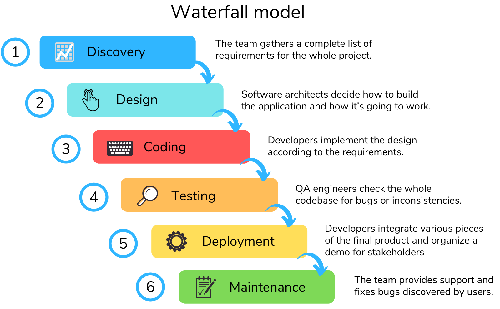 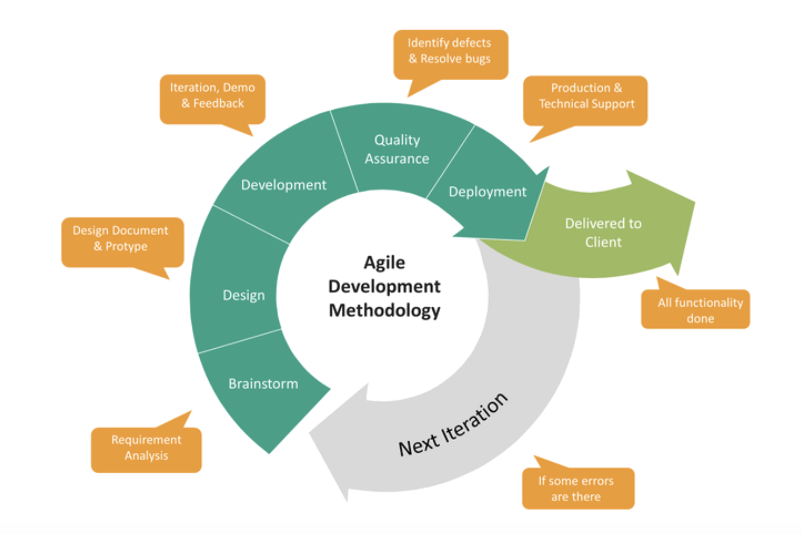

Documentation creation in Waterfall and Agile differs in the following major aspects:

- Timeframe: In Waterfall, documentation is created and completed at each stage before moving on to the next. All documents are developed and approved in advance, which usually happens at the beginning of the project.

  In Agile, documentation is developed as needed and can be changed or supplemented during development.

- **Level of detail**: In Waterfall, documentation typically represents detailed and extensive documents, such as technical specifications, architectural diagrams, and project plans.

  In Agile, documentation can be more flexible and elastic, including requirements summaries, notes, and progress reports.

- **Scope**: In Waterfall, documentation is used extensively to communicate information between project participants and stakeholders.

  In Agile, documentation can be more focused on communication within the development team to ensure alignment and understanding of tasks.

- **Flexible and changeable**: Waterfall assumes that documentation should be tightly bound to the project and changes require a formal change to the project plan.

  In Agile, documentation can be more flexible and can change as needed to reflect new requirements or changing priorities.

If we talk about "**Waterfall**" - it is assumed that all the requirements are known to us initially, and it is also assumed that they cannot change. In this case, we can write documentation before the development process begins
and accept the technical task as a basis for writing documentation.

In reality, this almost never happens, both in large and small organizations. If we talk about large organizations - then the main factor of the unknown is other systems with which you will need integrations. In small organizations, on the contrary, since the architectural landscape is not yet so rich, no one knows, even with precise planning, what will happen as a result of development.

Thus, in order to avoid doing the same work several times, at the initial stage of development or before its start, it is better for the system analyst to focus on designing the technical solution, and only when it begins to become clear which path you are taking, you can begin to begin documenting, but you must always be aware that the software logic may change until the very end of the development. Therefore, after the fact, you once again check with the development team for the correctness of the logic described in the documentation.

If we take **Agile**, iterative or incremental approaches as an example, then changing the requirement is almost the main paradigm. But if we write documentation, it is important for us to understand the following nuances: whether the increment developed within the sprint is independent functionality or software, how future or past increments will affect the logic of its work. That is, we need to understand the boundaries of this or that
software that is developed within one iteration.

Let me give you an example: for example, your development team develops one microservice in one sprint. A microservice is a separate entity, it is logical that the microservice needs documentation describing its operation.

Another case, you are doing a large project for a quarter or six months, as part of planning you broke it down into short iterations, within which in one sprint you develop a piece of one microservice, a piece of another
microservice, set up a message broker, roll out a new database, etc.

It is clear that in this case, within each iteration, it will be difficult for you to document the developed functionality. In this case, within one sprint, plan to create documentation for a separate component and describe it in parallel with the development, or plan time after the end of the development stage for creating documentation.

## CRITERIA FOR GOOD DOCUMENTATION

### Unambiguity

Unambiguity means that in the document we must unambiguously understand the logic of the operation of a particular software scenario. We should not have any misunderstandings about how the system will behave in a particular case: it may be one way, or another, this should not be. The documentation must clearly describe the scenario, trigger, and behavior of the system.

### Accuracy

This criterion partially follows from the previous one. By accuracy we mean that the document must be described in the most precise way. Based on the depth of detail, the document must clearly and accurately describe the logic of the functions.

### Relevance

Documentation should be relevant to the code, relevant to the working functions in the production environment. All relevant functions should be described.

Non-working functions should be marked as decommissioned. It is also important to update the documentation when new functions are added to the code.

### Unification

Documentation should be described in the accepted format for a particular type of functionality. If your company has adopted a single documentation standard for microservices, then the document should be made according to a single template.

### Referentiality

By this criterion, I mean such a property within which the documentation can be referenced in other documents or types of documentation and within the framework of the documentation being developed, I can refer to other documents or types of documentation. Thus, each individual documentation is a part, so to speak, of the documentation ecosystem in the organization. If documentation cannot be used in other documents, it can
lead to duplication of work and confusion. Therefore, it is important that documentation is well structured and easily accessible for use in other documents.

### Validability

Documentation must be checked for accuracy and completeness before publication. This ensures that the documentation contains all required information about the software and does not contain errors in the logic of the functions. Documentation reviews can be carried out by other analysts who work on similar projects, as well as developers and leads.

## MAIN TYPES OF DOCUMENTATION

### Project documentation

Complete documentation for the technical solution. Includes the architecture of the solution, which describes all the necessary components, business process diagrams, sequences, etc. In other words, this is a set of documents containing the most detailed and accurate information about the project.

The depth of such documentation should be as detailed as possible, i.e. such documentation should describe the logic of each component, if we reuse existing components, we must provide a link to them.

### Front-end documentation

Documentation describing the client part of the functionality, in other words, screens available to the user, and, as a rule, describes what functions and causes pressing a particular button, or going to a particular screen.

### Backend documentation

Documentation describing the main logic of work "under the hood": microservices or a monolithic system, message brokers, buses, and so on.

### Storage Documentation

Documentation describing the storage structure of data used by the software.

## TEXT DOCUMENTATION DESCRIPTION OF THE SOFTWARE OPERATION ALGORITHM

Text documentation, as a rule, we encounter when we want to study the logic of the legacy, monolith or simply old functionality, such software can be found in almost any organization. This type of documentation does not have any specific writing rules, in addition to the general principles that we discussed above. Despite the lack of a specific format (as a rule, each organization has its own), such documentation describes the algorithms of the service in as much detail as possible and meets all the necessary criteria for good documentation. Documentation of this type may look something like this:

1. User ID

The system finds the user ID in the Users table in the **Users.Id field**.

2. User type

The system determines the user type using the value in the UserTypes table in the UserTypes.Name field by the value key of the **Users.Type_Id = UserTypes.Id fields**.

3. User order history

The system finds the user's order history in the Orders table in the Orders.Id field by the value key of the **Users.Type_Id = Orders.User_Id fields**.

4. Detailed order information

Detailed order information is collected from the **select \* from Orders where id = “1234” user_id = “5678” query**.

5. New order

A new order is created in the Orders table, and a unique identification number is assigned to the
**Orders.Id** field. The **Orders.Status** field is set to “new”.

6. Payment for the order

After the user pays for the order, the value of the **Orders.Status** field changes from “new” to “confirmed”

## USER SCENARIOS USE CASE

According to Alistair Colbairn, use cases are scenarios that demonstrate how users interact with a system.
Use cases help to define system requirements and test its functionality.

Colbairn suggests four types of use cases:

- Primary Use Case - this is the main scenario of the system's operation, which shows how the system solves the user's main task.
- Secondary Use Case - this is a scenario that extends the primary use case and shows additional features of the system.
- Alternative Use Case - this use case shows how the user can use the system to solve a task other than the primary task.
- Exceptional Use Case - this type of use case shows how the system should respond to exceptional situations, such as data entry errors or system failures.

### Use Case

Checking student homework by reviewer and entering results

#### Scope:

- system for completing and checking homework

#### Participants and Interests:

- Student - wants to get a grade and feedback on homework
- Reviewer - wants to give the highest quality and detailed feedback on student homework

#### Trigger:

- student completes homework and sends it to reviewer for checking

Basic scenario:

1. The student submits the completed homework for checking
2. The system assigns a free reviewer to check the homework
3. The reviewer receives a notification about receiving a new homework for checking.
4. The reviewer confirms his/her assignment to the system and starts checking the homework.
5. The student receives a notification that a reviewer has started checking his/her homework and notifies which of the reviewers is checking it.
6. The reviewer checks all the tasks, assigns a score to each task and leaves a comment.
7. The student receives scores and feedback on each task.

Extensions:

2.. There are no available reviewers.

    a. The system notifies the student that the time for checking the homework will be increased due to the lack of currently available reviewers

    b. After a certain amount of time (configurable parameter), the system assigns a free reviewer to check the homework.

6.. In the process of checking the assignment, the reviewer finds out that the student has not fully completed the assignment.

    a. The reviewer marks the homework as not fully completed and sends the assignment for revision

    b. The student receives a notification that his homework has been returned with the status “For revision”

    c. The student revises the homework and sends it for review

7.. The student believes that the assessment and feedback on his homework are incorrect.

    a. The student selects the “appeal” option, gives additional comments on his assignment

    b. The system assigns a free reviewer, different from the reviewer who checked the assignment the first time, to check the homework.

    c. Then the script process continues from step 3 of the main process

## API DOCUMENTATION

Documentation for API services can be presented in different forms as Swagger or Postman.

In this example, we will consider an example of documentation for a microservice of an educational portal that allows a reviewer to check the work of students.

```
URL (resource): http://[host]/review/api/
GET http://[host]/review/api/tasks // get all tasks for review
```

**Input data**:

| Field       | Type   | Description |
| ----------- | ------ | ----------- |
| reviewer_id | string | Reviewer ID |

**Output data**:

| Field               | Type    | Description                                 |
| ------------------- | ------- | ------------------------------------------- |
| tasks               | array   | List of homework assignments to be reviewed |
| tasks[].id          | string  | ID of the assignment to be reviewed         |
| tasks[].homework_id | string  | ID of the homework assignment               |
| tasks[].student_id  | string  | ID of the student                           |
| tasks[].course_id   | string  | ID of the course                            |
| tasks[].reviewer_id | string  | ID of the reviewer                          |
| tasks[].status      | integer | Status of the assignment                    |
| tasks[].result      | integer | Result of the assessment                    |
| tasks[].feedback    | string  | Feedback from the reviewer                  |

```
GET http://[host]/review/api/tasks/[task_id] // get a specific task for checking
```

**Input data**:

| Field       | Type   | Description |
| ----------- | ------ | ----------- |
| reviewer_id | string | Reviewer ID |
| task_id     | string | Task ID     |

**Output data**:

| Field       | Type    | Description            |
| ----------- | ------- | ---------------------- |
| id          | string  | Task ID to be reviewed |
| homework_id | string  | Homework ID            |
| student_id  | string  | Student ID             |
| course_id   | string  | Course ID              |
| reviewer_id | string  | Reviewer ID            |
| status      | integer | Task status            |
| result      | integer | Assessment result      |
| feedback    | string  | Reviewer feedback      |

```
PATCH http://[host]/review/api/tasks/[task_id] // sending assessment and feedback on
homework
```

**Input data**:

| Field       | Type    | Description        |
| ----------- | ------- | ------------------ |
| reviewer_id | string  | Reviewer ID        |
| task_id     | string  | Task ID for review |
| status      | integer | Task status        |
| result      | integer | Evaluation result  |
| feedback    | string  | Reviewer feedback  |

**Output data**:

| Field       | Type    | Description            |
| ----------- | ------- | ---------------------- |
| task_id     | string  | Task ID to be reviewed |
| homework_id | string  | Homework ID            |
| student_id  | string  | Student ID             |
| course_id   | string  | Course ID              |
| reviewer_id | string  | Reviewer ID            |
| status      | integer | Task status            |
| result      | integer | Assessment result      |
| feedback    | string  | Reviewer feedback      |

```
GET http://[host]/review/api/students // get a list of students
```

**Input data**:

| Field       | Type   | Description |
| ----------- | ------ | ----------- |
| reviewer_id | string | Reviewer ID |

**Output data**:

| Field                  | Type   | Description                           |
| ---------------------- | ------ | ------------------------------------- |
| students               | array  | List of homework assignments to check |
| students[].student_id  | string | Student ID                            |
| students[].course_id   | string | Course ID                             |
| students[].reviewer_id | string | Reviewer ID                           |

```
GET http://[host]/review/api/students/[student_id] // get a list of homework
assignments for a specific student
```

**Input data**:

| Field       | Type   | Description |
| ----------- | ------ | ----------- |
| reviewer_id | string | Reviewer ID |

**Output data**:

| Field               | Type    | Description                                 |
| ------------------- | ------- | ------------------------------------------- |
| student_id          | string  | Student ID                                  |
| course_id           | string  | Course ID                                   |
| reviewer_id         | string  | Reviewer ID                                 |
| tasks               | array   | List of homework assignments to be reviewed |
| tasks[].id          | string  | ID of the assignment to be reviewed         |
| tasks[].homework_id | string  | ID of the homework assignment               |
| tasks[].student_id  | string  | Student ID                                  |
| tasks[].course_id   | string  | Course ID                                   |
| tasks[].reviewer_id | string  | Reviewer ID                                 |
| tasks[].status      | integer | Status of the assignment                    |
| tasks[].result      | integer | Assessment result                           |
| tasks[].feedback    | string  | Feedback from the reviewer                  |

## BUSINESS PROCESS DIAGRAM AND BPMN NOTATION

A business process diagram is a visual representation of the sequence of actions performed within a business process. It is needed to understand what actions are performed, in what sequence, who is responsible for performing each action and what results are expected at the output. A business process diagram helps to analyze and optimize the company's work, identify problem areas and improve work efficiency.

In other words, it is an artifact that describes the work of a particular business process of the functionality being developed. As a rule, BPMN 2.0 notation is used to create such
diagrams.

BPMN 2.0 notation includes the following elements:

- Event is a point in a process where something happens or can happen. Events can be triggers, such as the start or end of a process, or they can be the result of actions of other elements.
- Process is a set of actions that must be performed to achieve a specific goal. Processes can be automatic or
  manual.
- A Task is the work that needs to be done. Tasks can be as simple as sending an email or as complex as developing a new product.
- A Connector is a line that connects elements in a diagram.
  Connectors can be one-way or two-way, and they can have time or resource constraints.
- Data is the information that passes between elements in a diagram. Data can be text, numbers, images, or other
  formats.
- An Artifact is any object that is used in a process but is not part of the diagram. Artifacts can be documents,
  tools, or other resources that are needed to complete a process.

Let's look at an example of a business process diagram that shows the process of checking a student's homework by a reviewer.

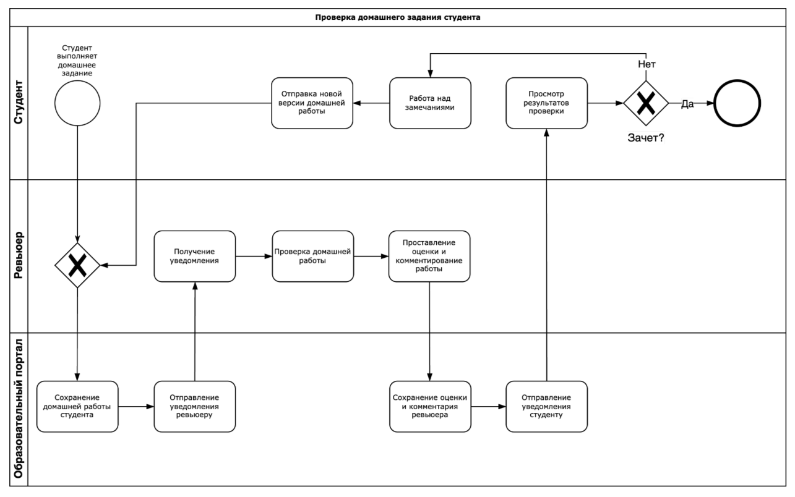

The diagram shows the student, the examiner and the educational portal system paths. We see how actions move from one path to another, forming a common business process.

The trigger for this process is the student completing his homework, the process is repeated until the student receives a "pass" for his homework.

## UML NOTATION SEQUENCE DIAGRAM

A UML (Unified Modeling Language) sequence diagram is a graphical tool used to visualize the interactions between objects in a system at a given point in time. It shows the order of messages passed between objects and allows you to analyze the flow of control in a system.

A UML sequence diagram consists of the following elements:

- Actors are external entities that interact with the system. They can be users, other systems, or external devices.
- Objects are instances of classes that are created when the system starts and destroyed when it stops. Objects can be actors, systems, or other elements of a sequence diagram.
- Lifelines in a sequence diagram show how much time an object or actor (actors in the system) is active in the diagram. It is like a line that starts from the object and goes down the vertical axis as long as the object is active. When the object is no longer active, the lifeline ends.
- Focus of control is the period of time during which an object performs a particular action, such as calculating or waiting for a response from another object.
- Messages are requests that actors send to systems or other actors. Messages can be synchronous (wait for a response) or asynchronous (do not wait for a response).

Let's consider an example of sequence diagrams that describe the integration process of a student's learning in a course. The diagrams include the actors Student and Homework Reviewer. If we talk about system objects, then we have a User Interface (UI), which is publicly available on the Internet, on the educational platform server we have several microservices: study-api - a common orchestrator microservice, through which all student and reviewer requests to the system go, course-api - a microservice responsible for issuing materials for training, homework-api - a microservice responsible for issuing homework for lectures, studentwork-api - a microservice that saves students' homework, shows it to reviewers and saves their grades and comments for further review by students.

Let's describe the sequence of the scenario depicted in the diagrams:

1. A student requests a new lecture to study via the UI;
2. The UI makes a request for a lecture to the study-api;
3. The study-api receives the request and makes a request to the lecture source course-api;
4. The course-api receives the request and returns the lecture material to the study-api;
5. The study-api returns the lecture material to the UI;
6. The UI displays the lecture to the student.

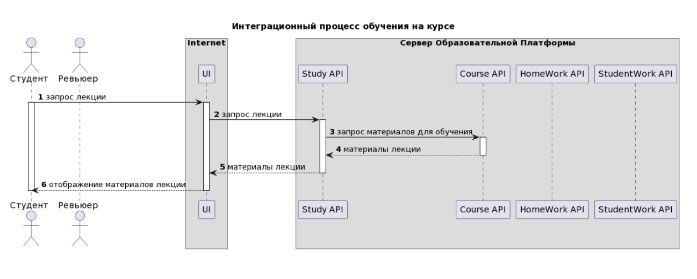

1. The student completes the lecture and notifies the system via the UI;
2. The UI receives the message and sends information to study-api about the student's completion of the lecture;
3. After the student completes the lecture, study-api requests homework from the homework source homework-api;
4. Homework-api returns homework materials to study-api;
5. Study-api returns homework materials to the UI;
6. The UI displays the homework to the student.

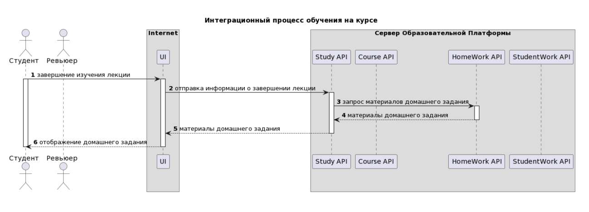

1. The student completes the homework and submits the solution via the UI;
2. The UI sends the solution to study-api;
3. Study-api sends the solution to studentwork-api;
4. Study-api sends a notification to the reviewer in the UI that he has a new homework to check;
5. The UI displays a notification to the reviewer.

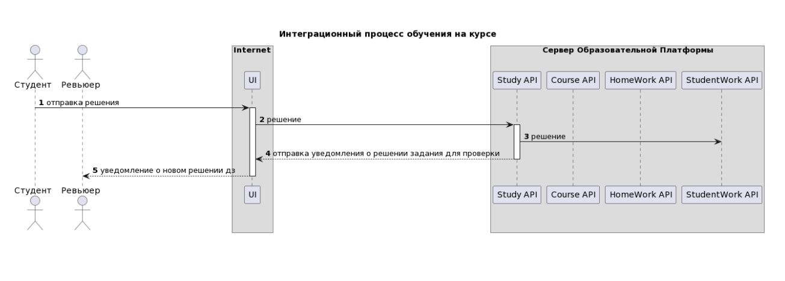

1. Reviewer requests homework solution via UI;
2. UI sends homework solution request to study-api;
3. Study-api makes a request for student homework solution to studentwork-api;
4. Studentwork-api returns student solution to study-api;
5. Study-api returns student solution to UI;
6. UI displays student work to reviewer.

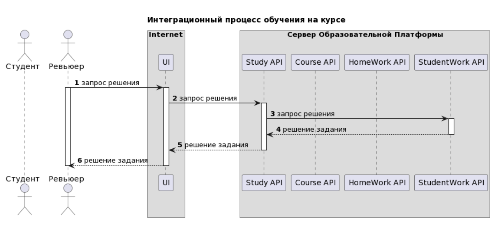

1. The reviewer grades and comments on the work via the UI;
2. The UI sends this data to study-api;
3. Study-api sends the results of the homework review to studentwork-api;
4. Study-api sends a notification to the student via the UI that his work has been reviewed;
5. The student receives a notification via the UI.

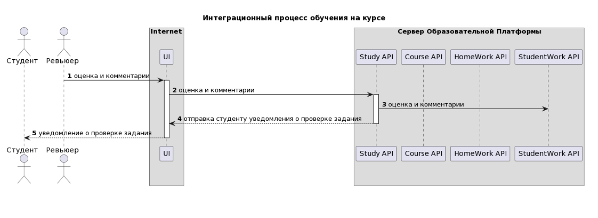

1. Student requests the result of his homework check via UI;
2. UI makes a request to study-api for data;
3. Study-api makes a request to studentwork-api;
4. Studentwork-api returns the results of check to study-api;
5. Study-api returns data to UI;
6. Student receives the results of check of his homework in UI.

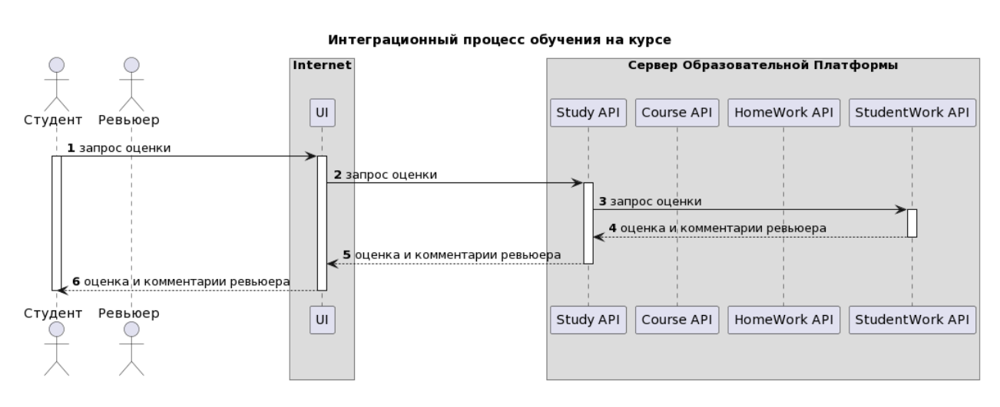

This diagram is one of the types of graphical representation and, of course, it can be created using graphical tools such as Draw.IO, Visio, Miro, etc. But, in my opinion, the most correct and canonical
way to create such a diagram is the plantuml markup language, which allows you to create any UML diagrams in a text editor.

Let's see how such diagrams look in [plantuml](https://www.planttext.com/) markup.

```uml
@startuml
autonumber
title "Integrated learning process in the course"
actor "Student" as student
actor "Reviewer" as reviewer
box "Internet"
participant "UI" as ui
end box
box Educational Platform Server
participant "Study API" as study
participant "Course API" as course
participant "HomeWork API" as hw
participant "StudentWork API" as shw
end box
student -> ui: lecture request
activate student
activate ui
ui -> study: lecture request
activate study
study -> course: study materials request
activate course
course --> study: lecture materials
deactivate course
study --> ui: lecture materials
deactivate study
ui --> student: lecture materials display
deactivate student
deactivate ui
deactivate student
@enduml
```

```uml
@startuml
autonumber
title "Integrated learning process on the course"
actor "Student" as student
actor "Reviewer" as reviewer
box "Internet"
participant "UI" as ui
end box
box Educational Platform Server
participant "Study API" as study
participant "Course API" as course
participant "HomeWork API" as hw
participant "StudentWork API" as shw
end box
student -> ui: end of lecture study
activate student
activate ui
ui -> study: send information about end of lecture
activate study
study -> hw: request for homework materials
activate hw
hw --> study: homework materials
deactivate hw
study --> ui: homework materials
deactivate study
ui --> student: display homework
deactivate ui
deactivate student
@enduml
```

```uml
@startuml
autonumber
title "Integrated learning process on the course"
actor "Student" as student
actor "Reviewer" as reviewer
box "Internet"
participant "UI" as ui
end box
box Educational Platform Server
participant "Study API" as study
participant "Course API" as course
participant "HomeWork API" as hw
participant "StudentWork API" as shw
end box
student -> ui: sending solution
activate ui
ui -> study: solution
activate study
study -> shw: solution
study --> ui: sending notification about task solution for checking
deactivate study
ui --> reviewer: notification about new homework solution
deactivate ui
deactivate student
@enduml
```

```uml
@startuml
autonumber
title "Integrated learning process in the course"
actor "Student" as student
actor "Reviewer" as reviewer
box "Internet"
participant "UI" as ui
end box
box Educational Platform Server
participant "Study API" as study
participant "Course API" as course
participant "HomeWork API" as hw
participant "StudentWork API" as shw
end box
reviewer -> ui: solution request
activate reviewer
activate ui
ui -> study: solution request
activate study
study -> shw: solution request
activate shw
shw --> study: task solution
deactivate shw
study --> ui: task solution
deactivate study
ui --> reviewer: task solution
deactivate ui
deactivate reviewer
@enduml
```

```uml
@startuml
autonumber
title "Integrated learning process in the course"
actor "Student" as student
actor "Reviewer" as reviewer
box "Internet"
participant "UI" as ui
end box
box Educational Platform Server
participant "Study API" as study
participant "Course API" as course
participant "HomeWork API" as hw
participant "StudentWork API" as shw
end box
reviewer -> ui: assessment and comments
activate ui
ui -> study: assessment and comments
activate study
study -> shw: assessment and comments
study --> ui: sending a notification to the student about the assignment review
deactivate study
ui --> student: notification about the assignment review
deactivate ui
@enduml
```

```uml
@startuml
autonumber
title "Integrated learning process in the course"
actor "Student" as student
actor "Reviewer" as reviewer
box "Internet"
participant "UI" as ui
end box
box Educational Platform Server
participant "Study API" as study
participant "Course API" as course
participant "HomeWork API" as hw
participant "StudentWork API" as shw
end box
student -> ui: evaluation request
activate student
activate ui
ui -> study: evaluation request
activate study
study -> shw: evaluation request
activate shw
shw --> study: reviewer's evaluation and comments
deactivate shw
study --> ui: reviewer's evaluation and comments
deactivate study
ui --> student: reviewer's evaluation and comments
deactivate ui
deactivate student
@enduml
```

## DATA MODELS AND ER DIAGRAM

In addition to processes and integrations, it is important for us to describe how the data used in our
service will be stored and linked. A graphical artifact such as an ER diagram is best suited for this purpose.
An ER diagram (Entity Relationship Diagram) is a tool for modeling databases that allows you to visualize entities, their attributes, and the relationships between them. It helps to define the structure of data, identify relationships between elements, and determine the necessary attributes. There are several types of ER diagrams, each with its own specifics and purpose.

In order to better understand this notation, let's study its basic elements.

An ER diagram consists of entities, entity attributes, and relationships between entities.

An entity is an object that has certain properties and can be unique or repetitive. Examples of entities: products, customers, orders.

An attribute is a property of an entity that can have a value. For example, a product has attributes: name, price, quantity in stock.

A relationship is a relationship between two entities. For example, the relationship “has” between the entities “product” and “order”, where one product can be in several orders.

Let's look at one of the most common notations as an example - the physical model of the Crow's Foot notation. This diagram shows how data can be stored in a service for checking homework in an online school

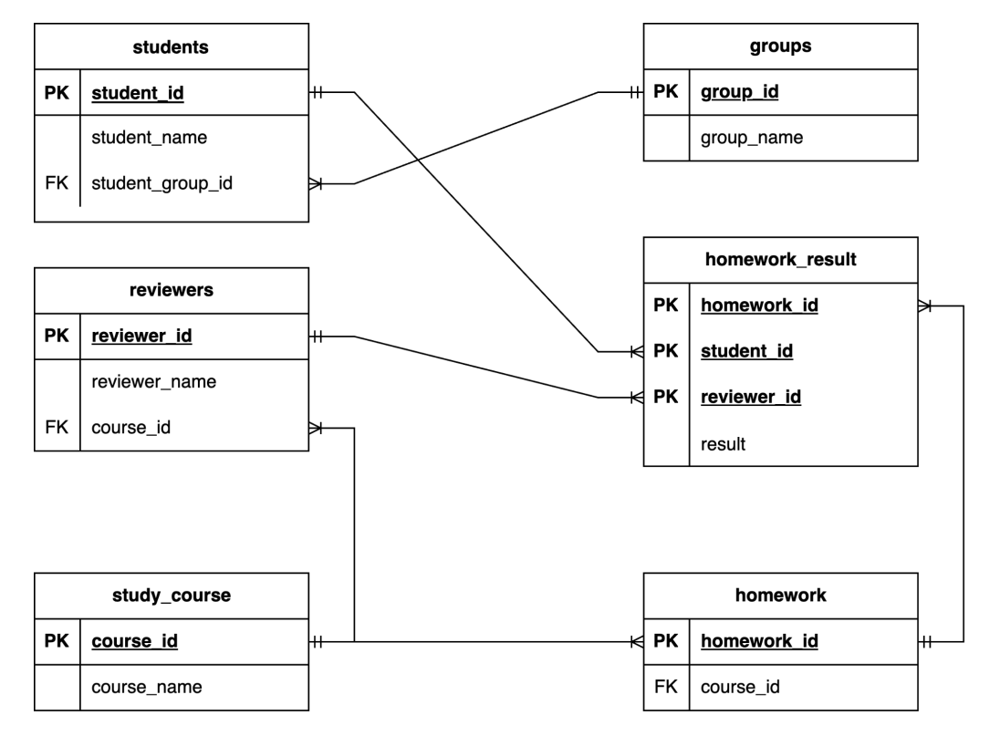

In this diagram we see that we have the following entities highlighted: students, student groups, reviewers, course, homework and homework results are highlighted as a separate entity.

Let's look at the relationships: we see that the entities students and student groups have a "many-to-one" relationship between them, that is, many students can study in one group, but a student cannot study in several
groups.

The relationship between reviewers and homework results is "one-to-many", that is, one reviewer checks many homework assignments, but one homework assignment is not checked by several reviewers. Reviewers also have a
"many-to-one" relationship with the course, that is, reviewers can only be inspectors for one
course.

Homework assignments relate to the course as many to one, that is, one course has many homework assignments, but a homework assignment cannot
belong to several courses.

Now let's look at the entity of homework results, this entity has a composite primary key, which consists of the identifiers of the homework, student and reviewer, thus forming a unique identifier from these three identifiers. As for the relationships, one homework has many results, because many students do one work, so the results will have a "many-to-one" relationship with the homework and "many-to-one" with the students.

It is also important to pay special attention to the entity of homework results, because this entity is an intermediate table of the relationship between the tables of students and homework, reviewers and homework. That is, there is a many-to-many relationship between the students and homework tables, because one student does many homework assignments, and one homework assignment is done by many students, but to record this data we lack these two entities, so an intermediate table is created, the same rule is true for the homework and reviewers tables: reviewers check many homework assignments, and one assignment from different students is checked by many reviewers.

## WHAT-IS-API?

An API allows different applications and services to work together as if they were part of a single larger application. For example, an API can allow one program to access the functions of another program, even if these programs were created by different developers.

One of the most famous APIs is the Google API, which provides access to a huge number of Google functions and services, such as Google Maps, Google Analytics, Google AdWords, etc.

How does it work? For example, if when developing an application or a website there is a need to display a map with the location of an office or point of sale, you do not need to create a new map, you use the API of ready-made maps and mark the location you need.

Various aggregator sites, such as news or exchange rate aggregators, or
weather also work through the API, the information provider services transmit it through the API to the aggregator site, which, in this case, is the consumer of
data.

### Why do you need API documentation?

API documentation is needed so that other developers and users can learn how your API works, what methods it has, what parameters to pass, and what response is expected. This helps to avoid errors and misunderstandings, and also speeds up the development and integration process.

In addition, good documentation can attract more users and partners who can use your API in their projects, if we are talking about public services that your partners or customers are expected to use.

### HTTP Request Methods

Before we dive into the structure of HTTP requests, let's review the main HTTP methods that we most often use when designing, developing, or using REST API services.

**GET**

The HTTP GET method requests a specified resource. Unlike other methods, such as POST, PUT, and DELETE, GET does not change the state of the server or the contents of the data. It is used to retrieve information such as HTML pages, images, files, and so on. A GET request can also include parameters that are passed through the URL, such as ?param=value.

**POST**

The HTTP POST method sends data to the server. It is often used to create new resources or write data to the server. Unlike GET, which can only transfer limited amounts of data, POST can transfer large amounts of data in the body of the request. PUT The PUT HTTP method is used to update a resource on the server. It passes the content that should be replaced on the server. This method is usually used when you want to update an existing resource.

**PATCH**

The PATCH HTTP method is designed to partially update a resource. It allows you to change only certain parts of the resource specified in the request. This method can be useful when you need to make changes to a resource, but do not want to replace the entire resource.

**DELETE**

The DELETE HTTP method is used to delete a resource on the server. It sends
a request to delete the specified resource, and if the server accepts the request, it
deletes the resource.

### HTTP Request and Response Structure

In order to correctly document API methods, we need to know the structure of the
http request and response.

There are several main elements in the HTTP request structure:

- Request method — specifies what action should be performed with the
  resource (GET, POST, PUT, PATCH, DELETE, etc.).
- URL — the address of the resource the client is accessing.
- Request headers — contain information about the request, such as the username
  and password, the language and encoding of the response, the type of the request content, etc.
- Request body — contains data that is transferred to the server in the body of the request (for example, when submitting a form or using the POST method).
- Response status code — an element of the response structure, indicates the result of the request (success, error, etc.) and may contain additional information about the error.

The structure of the request helps us answer the questions that the analyst asks during the service design process:

- What do we want to do? Get data from a resource, create data, update, delete? — Method.
- Where do we want to get the data from or where do we want to send it? — URL.
- What do we want to pass in the request? — Request body.
- In what format do we want to send/receive the data? — Request headers.

Visually, requests look like this:

**GET**

```
Request:
GET /api/products HTTP/1.1
Host: api.example.com
Accept: application/json
Answer:
HTTP/1.1 200 OK
Content-Type: application/json
[
{
"product_id":1,
"name":“Product 1”,
"description":“Description of product 1”
},
{
"product_id":2,
"name":“Product 2”,
"description":“Description of product 2”
}
]
```

**POST**

```
Request:
POST /api/v1/user/register HTTP/1.1
Host: example.com
Content-Type: application/json
Cache-Control: no-cache
Postman-Token: 7ef3cb42-f37d-48a0-9377-80d4b6157f13

{
"username":"JohnDoe",
"email":"johndoe@example.com",
"password":“12345678”
}

Answer:
HTTP/1.1 201 Created Location: /api/v1/user/123 Content-Type:
application/json

{
"message":"User created successfully",
"user":{
"id":"123",
"username":"JohnDoe",
"email":"johndoe@example.com"
}
}
```

### OpenAPI Notation

OpenAPI is a specification for describing APIs, allowing developers to better understand how to work with them. OpenAPI provides detailed information about API methods, input and output parameters, possible errors, etc.

OpenAPI Notation is a way of writing the OpenAPI specification. It uses a specific syntax and structure to describe the API. The notation allows you to create clear and understandable documents that are easy to read and understand.

One of the main features of the OpenAPI notation is its flexibility. It allows you to describe APIs of any complexity, from simple RESTful services to complex integrations with many parameters and dependencies. The notation also supports the description of both public and private APIs, which makes it universal and applicable to a wide range of tasks.

The OpenAPI specification is written in YAML or JSON formats, these formats are maximally intuitive and easy to study and understand, so such specification can be read by both humans and machines.

Now let's look at the basic elements of the notation.

Metadata

- OpenAPI specification version
- Info section - general information about the API:
  - title - service name
  - description - service description
  - version - service version
  - contact - contact information

**Servers**

Base path of the resource

**Paths**

Path to a specific service resource

**Params**

Request parameters - what we pass in the request "at the input"

**Responses**

The method's response to our request.

In our example, we will consider an API for checking students' homework.

At the beginning, we fill in the metadata and enter information about the version of the OpenAPI notation and information about our service

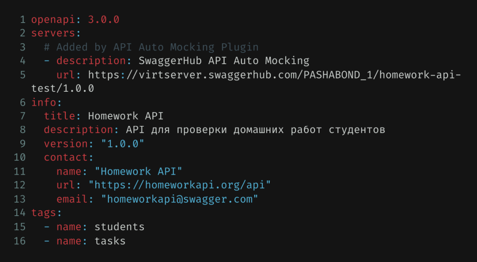

The first field "openapi" - here the version of the notation is written. By default,
swagger itself offers the latest working version when creating documentation.

The "servers" field - here the path to the main resource is written, that is, the path to the API.

If desired, you can create several servers: for the test, pre-combat and combat contours. For familiarization, study and to avoid unnecessary confusion.

In the "title" field we write the name of the API.

In the "description" field we describe in detail the functional purpose of the service.
The "version" field, as you might guess, means the version of the service.

In the "contact" contacts we can write various details, the developer's mailbox, website, etc.

We also decided to add "tags" to the example right away, which we will need later. In our case, tags are needed to visually separate methods by the resources we work with. You can use tags and thus separate methods into sections by any criteria you like. It looks like this.

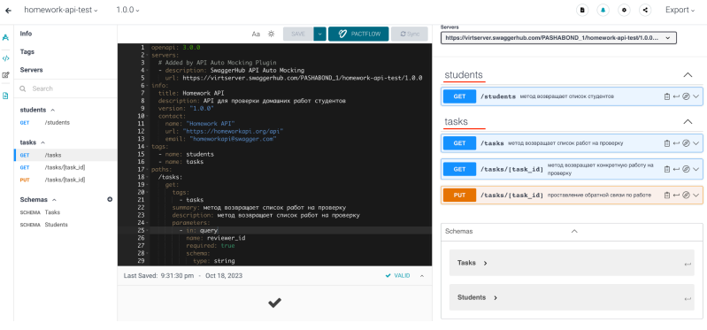

In the main interface for working with our documentation, we can see that our methods are divided into sections "students" and "tasks" - this is precisely the consequence of
binding methods to tags that we set at the very beginning of the documentation description.

After that, we need to designate paths, that is, specific resources with which we
will work, in our case these are tasks, specific homework assignments of students, and students, students who are doing homework.

In the case of the tasks resource, we will also use the tasks/[task_id] resource
to designate that we are working with a specific resource object.

Methods intended for working with a specific resource are written in the root of a specific path, it looks like this:

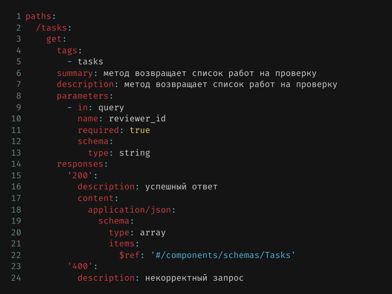

First, we open the root section "paths", in which specific resources with which we will work are registered. When writing documentation, it is important to take into account the indents, which designate logical levels.

At the next level, we register the first resource "tasks" through the "/" symbol.
After we have registered specific resources for work, at the next logical level (and indent), we register the methods that we will use to work with the resource.

With the third line in the figure, we begin to describe the method, in this case it is the "get" method. What should be written in the root of the method? We bind the method to the "tasks" tag for convenient use of the interface. I fill in the "summary" and
"description" fields with the same information, nominally the "summary" field
is intended for brief information about the method, and the "description" field is for
detailed information.

In the "parameters" root, we write the parameters that are passed in the request
to obtain the information we need. In this case, we pass the value of the "reviewer_id" field to get homework assignments that are bound to the reviewer's ID. As a rule, the input parameters contain either the user ID or his token, which he receives as a result of the authentication process. This logic is laid down so that the user receives data that is intended only for him, this is regulated either by writing his identifier in the attributes of objects, or in the access settings for the user level.

Pay attention to lines 9 through 13 to understand how one parameter is written. In line 13, the data type of the input parameter is written, in our case it is a string.
The description of the method also describes various options for server responses. I decided to use the most common scenarios: successful and unsuccessful, if desired and given the different variability of your services, you can write separate responses for at least each http code.

The service responses within a certain method begin to be described on line
14 of the figure. We write the response code, in the "description" field we describe the code, then we need to describe an example of a specific response. In our case, this will be a response in json format, as in most cases when working with restful services. In line 18, we just write the response format. Please note that when describing the response example itself, I refer to the Tasks scheme (line 22), which I write just below the main description. It looks like this.

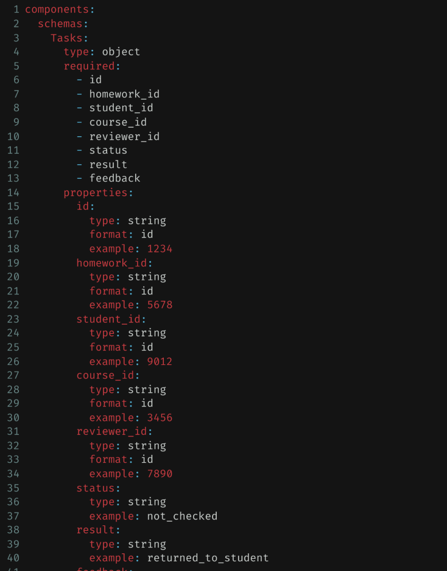

First, we describe the required fields for the response. In our case, these are id,
homework_id, student_id, course_id, reviewer_id, status, result, feedback. Then, we
describe the properties for each attribute in the "properties" root. Each field
has properties such as "type" and "example" and an optional "format". We have
the format of each attribute as a string, which we indicate in the type field, and in the "example" field we write an example of how a particular attribute is filled.
Below, we can already see how the schema setup looks in json format in the example
response in the documentation itself.

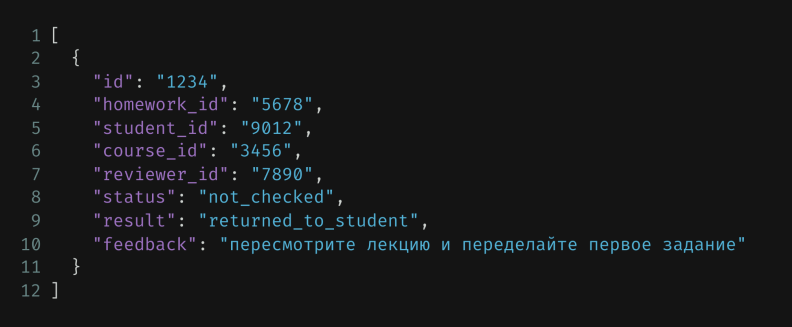

We continue working with the paths root and add the following path to the resource
/tasks/[task_id] to work with the identifier of a specific task.

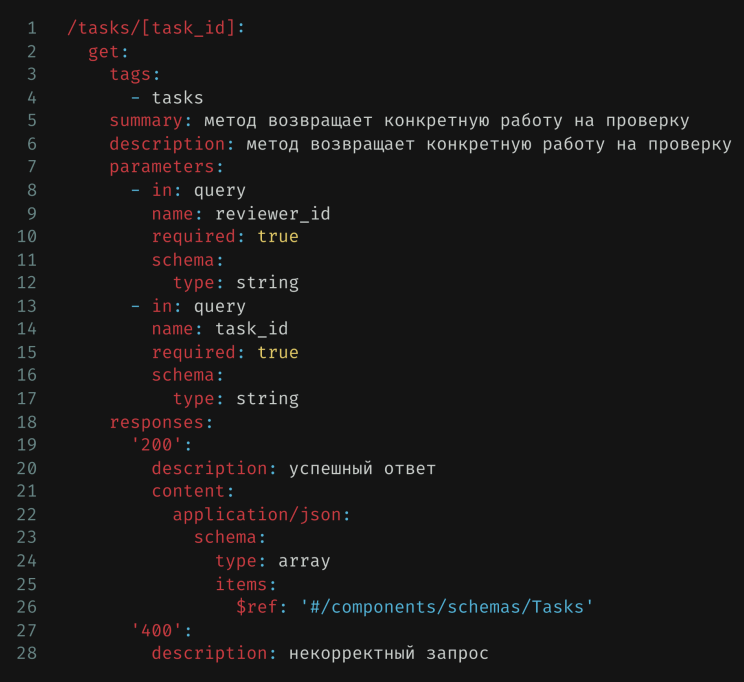

In terms of the format of the description of this request, get is not much different from the previous one, I use the same scheme when describing the response. The only difference in these two methods is that in one case it is assumed that the response
comes more than one object, and in this case I get data on a specific object, which I requested in the input parameters. This is the main difference, in the parameters root I write not only reviewer_id, as I did before, I also write task_id to get data for a specific task.

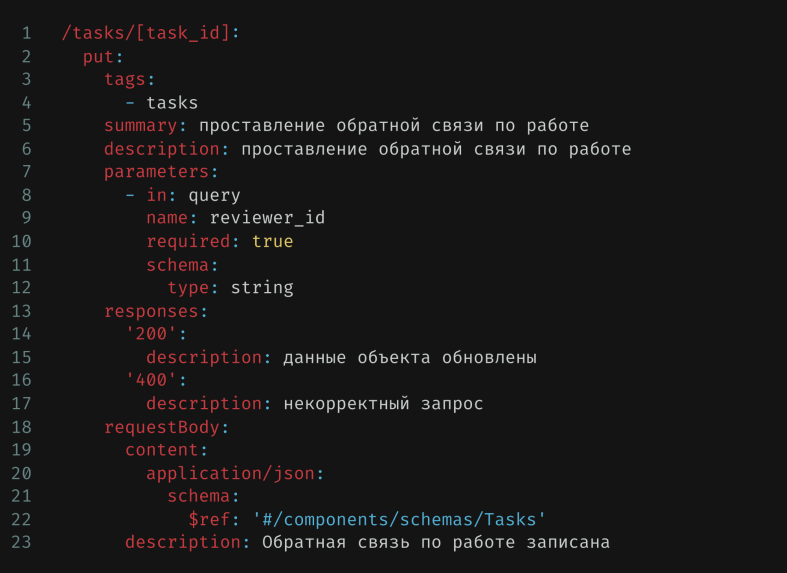

In the POST and PUT methods, we keep the same format of the request description, only,
in addition to the parameters, we must write the request body, since we either create or
update the resource object. In the request body, I still refer to the Tasks scheme that I created, described above.

Now let's look at the students resource and the get method, with which we request a list of students. In terms of the method description format, we will not see anything new here. We use the "students" tag and the "students" scheme for the response example,
respectively.

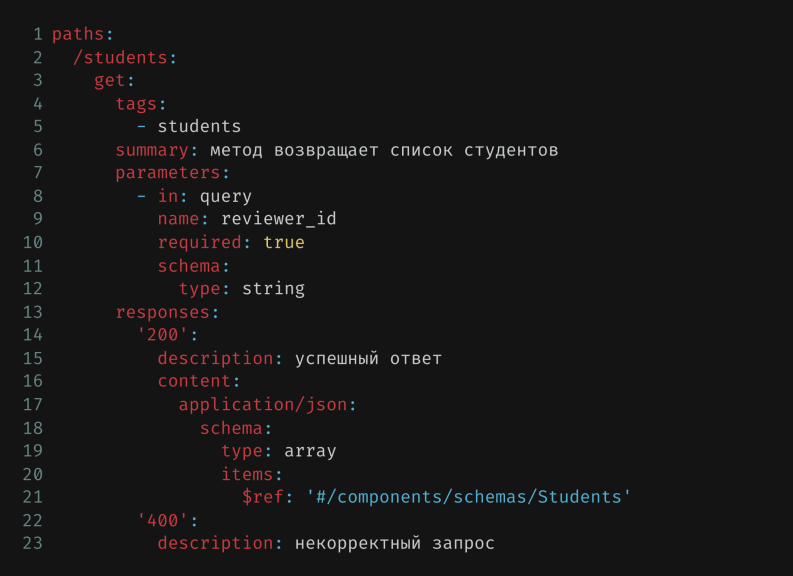

The most interesting thing here is precisely in the Students schema, which is used for the method's response example. Let's take a closer look at it.

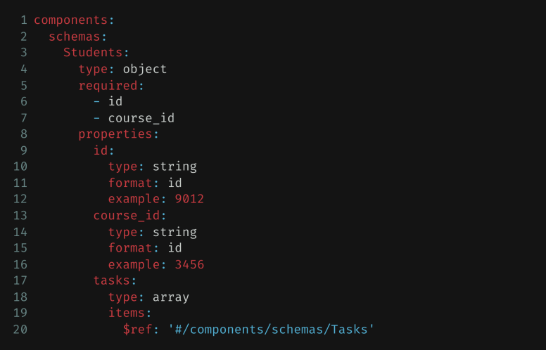

The Students schema is almost the same format as the Tasks schema with one small difference. In line 20 we see a nested Tasks schema, so we nest an array of homework completed by a specific student. In json format it looks like this:

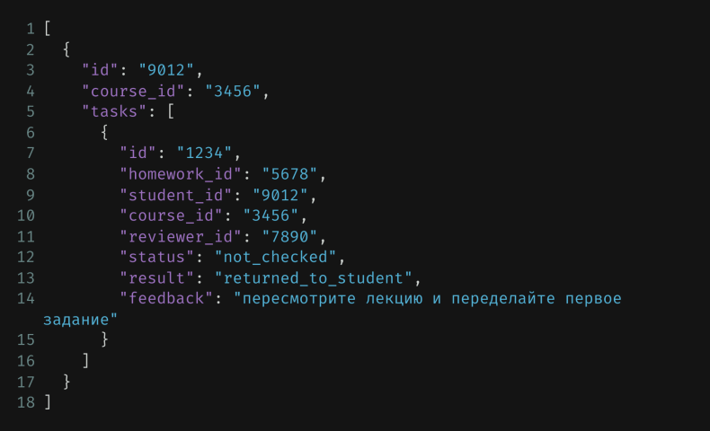

In response to the get method, we get back the student ID, the ID of his course, and his completed homework.

That is, when we make a get request for a list of students, we get back the students with the nested homework in the format of an array of data that they complete (see line 5-15 in the screenshot above).

## UML SEQUENCE DIAGRAM SEQUENCE

OpenAPI describes the API from the client's point of view. It defines what requests can be sent, what parameters are passed, what responses are returned, and how to process them. This helps clients understand how to work with the API and simplifies the development process.

UML Sequence, in turn, answers the question "how is this or that service structured?", that is, "what does it do under the hood?", what sources does the API use to provide this or that data, what systems is it integrated with.

Thus, the UML Sequence diagram allows us to visualize the sequence of actions that occur when a certain API method is called.

As we know from the previous lesson, a sequence diagram describes how components interact with each other within a particular system function. This representation is well suited for describing the logic of the API.

Let's also remember what main elements a sequence diagram consists of. A UML sequence diagram consists of the following elements:

- Actors are external entities that interact with the system. They can be users, other systems, or external devices.
- Objects are instances of classes that are created when the system starts and destroyed when it stops. Objects can be actors, systems, or other elements of a sequence diagram.
- Lifelines in a sequence diagram show how much time an object or actor (actors in the
  system) is active in the diagram. It is like a line that starts from the object and goes down the vertical axis as long as the object is active. When the object is no longer active, the lifeline ends.
- Focus of control is the period of time during which an object performs a specific action, such as calculating or waiting for a response from another object.
- described in the OpenAPI specification.

GET /students - the method returns a list of students

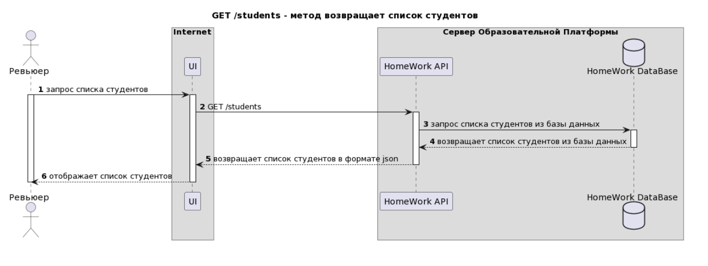

Let's describe the sequence diagram scenario:

1. The reviewer, using the user interface, requests a list of students.
2. The user interface makes a get request to the /students resource in HomeWork API.
3. HomeWork API receives the request from the user interface and, in turn, requests data from the HomeWork DataBase.
4. The HomeWork DataBase returns the requested data on the list of students to the HomeWork API.
5. HomeWork API returns the list of students to the user interface in json format.
6. The user interface displays the list of students to the reviewer.

GET /tasks - method returns a list of homework to check


Let's describe the sequence diagram scenario:

1. The reviewer, using the user interface, requests a list of homework to review.
2. The user interface makes a get request to the /tasks resource in the HomeWork API.
3. The HomeWork API receives the request from the user interface and, in turn, requests data from the HomeWork DataBase.
4. The HomeWork DataBase returns the requested data on the list of homework to review to the HomeWork API.
5. The HomeWork API returns the list of homework to review in json format to the user interface.
6. The user interface displays the list of homework to review to the reviewer.

GET /tasks/[task_id] - the method returns a specific task for verification

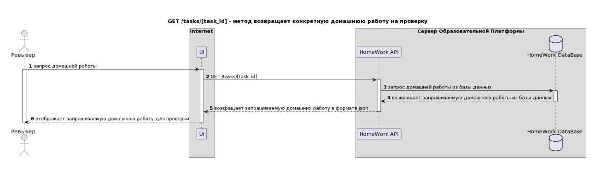

Let's describe the sequence diagram scenario:

1. The reviewer, using the user interface, requests a specific homework to check by its ID.
2. The user interface makes a get request to the resource /tasks/[task_id] in HomeWork API.
3. HomeWork API receives the request from the user interface and, in turn, requests data from the HomeWork DataBase.
4. The HomeWork DataBase returns the requested homework data to the HomeWork API.
5. HomeWork API returns the homework to the user interface for review in json format.
6. The user interface displays the requested homework to the reviewer for review.

PUT /tasks/[task_id] - entering feedback on the work

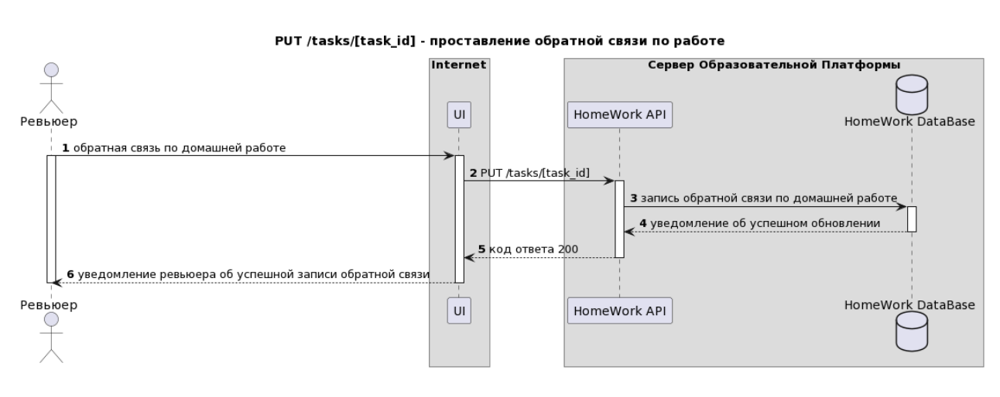

Let's describe the sequence diagram scenario:

1. The reviewer, using the user interface, leaves feedback on a homework task with a specific task ID.
2. The user interface makes a put request to the resource /tasks/[task_id] in HomeWork API.
3. HomeWork API receives the request from the user interface and, in turn, contacts the HomeWork DataBase to update the data.
4. The HomeWork DataBase returns a notification to the HomeWork API about the successful data update.
5. HomeWork API returns a successful response code - 200 to the user interface.
6. The user interface notifies the reviewer about the successful recording of the feedback.

### PlantUML for creating UML Sequence

Let's look at the previously created diagrams in the form of the PlantUML markup language.

GET /students - the method returns a list of students

```
@startuml
autonumber
title "GET /students - метод возвращает список студентов"
actor "Ревьюер" as reviewer
box "Internet"
participant "UI" as ui
end box
box Сервер Образовательной Платформы
participant "HomeWork API" as hw
database "HomeWork DataBase" as hwdb
end box
reviewer -> ui: запрос списка студентов
activate reviewer
activate ui
ui -> hw: GET /students
activate hw
hw -> hwdb: запрос списка студентов из базы данных
activate hwdb
hwdb --> hw: возвращает список студентов из базы данных
deactivate hwdb
hw --> ui: возвращает список студентов в формате json
deactivate hw
ui --> reviewer: отображает список студентов
deactivate ui
deactivate reviewer
@enduml

```

GET /tasks - the method returns a list of tasks to check

```
@startuml
autonumber
title "GET /tasks - метод возвращает список домашних работ на
проверку"
actor "Ревьюер" as reviewer
box "Internet"
participant "UI" as ui
end box
box Сервер Образовательной Платформы
participant "HomeWork API" as hw
database "HomeWork DataBase" as hwdb
end box
reviewer -> ui: запрос списка домашних работ на проверку
activate reviewer
activate ui
ui -> hw: GET /tasks
activate hw
hw -> hwdb: запрос списка домашних работ на проверку из базы
данных
activate hwdb
hwdb --> hw: возвращает список домашних работ на проверку из базы
данных
deactivate hwdb
hw --> ui: возвращает список домашних работ на проверку в формате
json
deactivate hw
ui --> reviewer: отображает список домашних работ на проверку
deactivate ui
deactivate reviewer
@enduml

```

GET /tasks/[task_id] method returns a specific task to check

```
@startuml
autonumber
title "GET /tasks/[task_id] - метод возвращает конкретную
домашнюю работу на проверку"
actor "Ревьюер" as reviewer
box "Internet"
participant "UI" as ui
end box
box Сервер Образовательной Платформы
participant "HomeWork API" as hw
database "HomeWork DataBase" as hwdb
end box
reviewer -> ui: запрос домашней работы
activate reviewer
activate ui
ui -> hw: GET /tasks/[task_id]
activate hw
hw -> hwdb: запрос домашней работы из базы данных
activate hwdb
hwdb --> hw: возвращает запрашиваемую домашнюю работы из базы
данных
deactivate hwdb
hw --> ui: возвращает запрашиваемую домашних работу в формате
json
deactivate hw
ui --> reviewer: отображает запрашиваемую домашнюю работу для
проверки
deactivate ui
deactivate reviewer
@enduml
```

PUT /tasks/[task_id] - entering feedback on the work

```
@startuml
autonumber
title "PUT /tasks/[task_id] - проставление обратной связи по
работе"
actor "Ревьюер" as reviewer
box "Internet"
participant "UI" as ui
end box
box Сервер Образовательной Платформы
participant "HomeWork API" as hw
database "HomeWork DataBase" as hwdb
end box
reviewer -> ui: обратная связь по домашней работе
activate reviewer
activate ui
ui -> hw: PUT /tasks/[task_id]
activate hw
hw -> hwdb: запись обратной связи по домашней работе
activate hwdb
hwdb --> hw: уведомление об успешном обновлении
deactivate hwdb
hw --> ui: код ответа 200
deactivate hw
ui --> reviewer: уведомление ревьюера об успешной записи обратной
связи
deactivate ui
deactivate reviewer
@enduml
```
